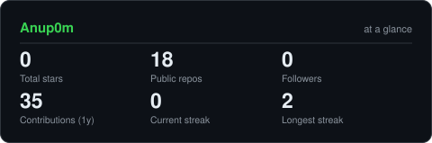

 <div align="center">

<!-- PORTRAIT -->


<br>

<!-- NAME / TAGLINE - animated typing -->
<a href="https://github.com/Anup0m">
  
</a>

<br>

<!-- SOCIALS -->
<a href="https://linkedin.com/in/anupam-pandey-94b5b0256"></a>
<a href="mailto:anupampandey9s2020@gmail.com"></a>
<a href="https://github.com/Anup0m"></a>


</div>

---

## `~/` whoami

```console
$ cat about.txt
```

Hi, I'm **Anupam Pandey**. Third-year Computer Science Engineering student with hands-on experience building end-to-end AI systems — from RAG pipelines and semantic search to computer vision and full-stack web platforms.

- 🚀 Currently building **[KANAD S.H.I.E.L.D.](https://github.com/Anup0m/KANAD-S.H.I.E.L.D._LAWSEARCHER_Dataminds)** & **[LinkedIn Auto-Connect Pro](https://github.com/Anup0m/linkedinautoconnecter1.0)**
- 🎓 Education: **Karnavati University** — B.Tech in Computer Science Engineering (2024 – 2028)
- 📍 Location: **Delhi, India**
- ⚡ Focus: **Applied AI/LLM Engineering, Computer Vision, & Scalable Web Applications**

<br>

<div align="center">

## `~/` toolbox


</div>

---

<div align="center">

## `~/` skill radar

<table>
<tr>
<td width="50%" align="center" valign="middle">

<!-- Self-rated radar - edit assets/skills.json, the workflow redraws it -->
<picture>
  <source media="(prefers-color-scheme: dark)"  srcset="assets/radar-dark.svg">
  <source media="(prefers-color-scheme: light)" srcset="assets/radar-light.svg">
  
</picture>

</td>
<td width="50%" align="center" valign="middle">

<!-- Live radar built from real language byte counts across your repos -->
<picture>
  <source media="(prefers-color-scheme: dark)"  srcset="assets/radar-langs-dark.svg">
  <source media="(prefers-color-scheme: light)" srcset="assets/radar-langs-light.svg">
  
</picture>

</td>
</tr>
</table>

</div>

---

<div align="center">

## `~/` contribution calendar

<!-- 3D isometric calendar, regenerated every 6h by .github/workflows/metrics.yml -->


<br><br>

<!-- Snake eats the contribution graph - .github/workflows/snake.yml -->
<picture>
  <source media="(prefers-color-scheme: dark)"  srcset="https://raw.githubusercontent.com/Anup0m/Anup0m/output/snake-dark.svg">
  <source media="(prefers-color-scheme: light)" srcset="https://raw.githubusercontent.com/Anup0m/Anup0m/output/snake.svg">
  
</picture>

</div>

---

<div align="center">

## `~/` the numbers

<picture>
  <source media="(prefers-color-scheme: dark)"  srcset="assets/card-stats-dark.svg">
  <source media="(prefers-color-scheme: light)" srcset="assets/card-stats-light.svg">
  
</picture>

<br>


<br><br>


</div>

---

<div align="center">

## `~/` selected work

<sub>

| project | live demo / repository | stack |
|---|---|---|
| **[KANAD S.H.I.E.L.D.](https://github.com/Anup0m/KANAD-S.H.I.E.L.D._LAWSEARCHER_Dataminds)** | [Live Demo](https://kanad-s-h-i-e-l-d-lawsearcher-datam-chi.vercel.app/) | `Python` `FastAPI` `React` `Supabase` `Gemini` `pgvector` |
| **[LinkedIn Auto-Connect Pro](https://github.com/Anup0m/linkedinautoconnecter1.0)** | [GitHub Repo](https://github.com/Anup0m/linkedinautoconnecter1.0) | `JavaScript` `Chrome Extension Manifest V3` `ES6+` |
| **[GOATS Investment Platform](#)** | [SEBI Research Analyst Baskets](#) | `Next.js 14` `TypeScript` `Prisma` `SQLite` `Recharts` |
| **[Brain Tumor Detection](#)** | [GPU Fast Inference API](#) | `Python` `YOLOv8` `PyTorch` `ResNet-18` `FastAPI` `OpenCV` |
| **[Antibody Escape Predictor](#)** | [COVID Variant ML Predictor](#) | `Python` `XGBoost` `scikit-learn` `Flask` `Pandas` |

</sub>

</div>

---

<div align="center">

<sub>`01110100 01101000 01100001 01101110 01101011 01110011 00100000 01100110 01101111 01110010 00100000 01110011 01100011 01110010 01101111 01101100 01101101 01101001 01101110 01100111`</sub>

</div>
