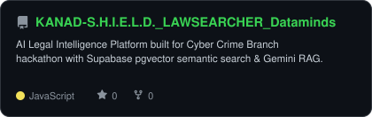
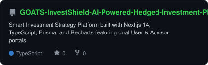
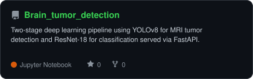
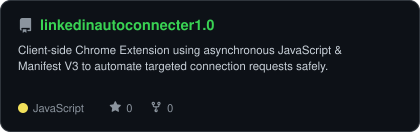
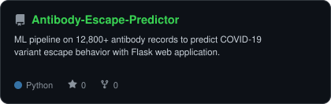

<div align="center">

<!-- PORTRAIT -->


<br>

<!-- NAME / TAGLINE - animated typing -->
<a href="https://github.com/Anup0m">
  
</a>

<br>

<!-- SOCIALS -->
<a href="https://linkedin.com/in/anupam-pandey-94b5b0256"></a>
<a href="mailto:anupampandey9s2020@gmail.com"></a>
<a href="https://github.com/Anup0m"></a>


</div>

---

## `~/` whoami

```console
$ cat about.txt
```

Hi, I'm **Anupam Pandey**. Third-year Computer Science Engineering student with hands-on experience building end-to-end AI systems — from RAG pipelines and semantic search to computer vision and full-stack web platforms.

- 🚀 Currently building **[KANAD S.H.I.E.L.D.](https://github.com/Anup0m/KANAD-S.H.I.E.L.D._LAWSEARCHER_Dataminds)** & **[GOATS Investment Platform](https://github.com/Anup0m/GOATS-InvestShield-AI-Powered-Hedged-Investment-Platform)**
- 🎓 Education: **Karnavati University** — B.Tech in Computer Science Engineering (2024 – 2028)
- 📍 Location: **Delhi, India**
- ⚡ Focus: **Applied AI/LLM Engineering, Computer Vision, & Scalable Web Applications**

<br>

<div align="center">

## `~/` toolbox


</div>

---

<div align="center">

## `~/` skill radar

<table>
<tr>
<td width="50%" align="center" valign="middle">

<!-- Self-rated radar - edit assets/skills.json, the script redraws it -->
<picture>
  <source media="(prefers-color-scheme: dark)"  srcset="assets/radar-dark.svg">
  <source media="(prefers-color-scheme: light)" srcset="assets/radar-light.svg">
  
</picture>

</td>
<td width="50%" align="center" valign="middle">

<!-- Live radar built from real language byte counts across Anup0m repos -->
<picture>
  <source media="(prefers-color-scheme: dark)"  srcset="assets/radar-langs-dark.svg">
  <source media="(prefers-color-scheme: light)" srcset="assets/radar-langs-light.svg">
  
</picture>

</td>
</tr>
</table>

</div>

---

<div align="center">

## `~/` selected work

<table>
<tr>
<td width="50%">
  <a href="https://github.com/Anup0m/KANAD-S.H.I.E.L.D._LAWSEARCHER_Dataminds">
    <picture>
      <source media="(prefers-color-scheme: dark)"  srcset="assets/card-KANAD-S.H.I.E.L.D._LAWSEARCHER_Dataminds-dark.svg">
      <source media="(prefers-color-scheme: light)" srcset="assets/card-KANAD-S.H.I.E.L.D._LAWSEARCHER_Dataminds-light.svg">
      
    </picture>
  </a>
</td>
<td width="50%">
  <a href="https://github.com/Anup0m/GOATS-InvestShield-AI-Powered-Hedged-Investment-Platform">
    <picture>
      <source media="(prefers-color-scheme: dark)"  srcset="assets/card-GOATS-InvestShield-AI-Powered-Hedged-Investment-Platform-dark.svg">
      <source media="(prefers-color-scheme: light)" srcset="assets/card-GOATS-InvestShield-AI-Powered-Hedged-Investment-Platform-light.svg">
      
    </picture>
  </a>
</td>
</tr>
<tr>
<td width="50%">
  <a href="https://github.com/Anup0m/Brain_tumor_detection">
    <picture>
      <source media="(prefers-color-scheme: dark)"  srcset="assets/card-Brain_tumor_detection-dark.svg">
      <source media="(prefers-color-scheme: light)" srcset="assets/card-Brain_tumor_detection-light.svg">
      
    </picture>
  </a>
</td>
<td width="50%">
  <a href="https://github.com/Anup0m/linkedinautoconnecter1.0">
    <picture>
      <source media="(prefers-color-scheme: dark)"  srcset="assets/card-linkedinautoconnecter1.0-dark.svg">
      <source media="(prefers-color-scheme: light)" srcset="assets/card-linkedinautoconnecter1.0-light.svg">
      
    </picture>
  </a>
</td>
</tr>
<tr>
<td width="100%" colspan="2" align="center">
  <a href="https://github.com/Anup0m/Antibody-Escape-Predictor">
    <picture>
      <source media="(prefers-color-scheme: dark)"  srcset="assets/card-Antibody-Escape-Predictor-dark.svg">
      <source media="(prefers-color-scheme: light)" srcset="assets/card-Antibody-Escape-Predictor-light.svg">
      
    </picture>
  </a>
</td>
</tr>
</table>

<sub>

| project | repository / demo | stack |
|---|---|---|
| **[KANAD S.H.I.E.L.D.](https://github.com/Anup0m/KANAD-S.H.I.E.L.D._LAWSEARCHER_Dataminds)** | [Live Demo](https://kanad-s-h-i-e-l-d-lawsearcher-datam-chi.vercel.app/) $\cdot$ [GitHub](https://github.com/Anup0m/KANAD-S.H.I.E.L.D._LAWSEARCHER_Dataminds) | `Python` `FastAPI` `React` `Supabase` `Gemini` `pgvector` |
| **[GOATS Platform](https://github.com/Anup0m/GOATS-InvestShield-AI-Powered-Hedged-Investment-Platform)** | [GitHub Repo](https://github.com/Anup0m/GOATS-InvestShield-AI-Powered-Hedged-Investment-Platform) | `Next.js 14` `TypeScript` `Prisma` `SQLite` `Recharts` |
| **[Brain Tumor Detection](https://github.com/Anup0m/Brain_tumor_detection)** | [GitHub Repo](https://github.com/Anup0m/Brain_tumor_detection) | `Python` `YOLOv8` `PyTorch` `ResNet-18` `FastAPI` `OpenCV` |
| **[LinkedIn Auto-Connect Pro](https://github.com/Anup0m/linkedinautoconnecter1.0)** | [GitHub Repo](https://github.com/Anup0m/linkedinautoconnecter1.0) | `JavaScript (ES6+)` `Chrome Extension Manifest V3` |
| **[Antibody Escape Predictor](https://github.com/Anup0m/Antibody-Escape-Predictor)** | [GitHub Repo](https://github.com/Anup0m/Antibody-Escape-Predictor) | `Python` `XGBoost` `scikit-learn` `Flask` `Pandas` |

</sub>

</div>

---

<div align="center">

<sub>Design architecture & artwork engine inspired by <a href="https://github.com/gargibhardwaj24">Gargi Bhardwaj</a></sub>

<br><br>

<sub>`01110100 01101000 01100001 01101110 01101011 01110011 00100000 01100110 01101111 01110010 00100000 01110011 01100011 01110010 01101111 01101100 01101100 01101001 01101110 01100111`</sub>

</div>
